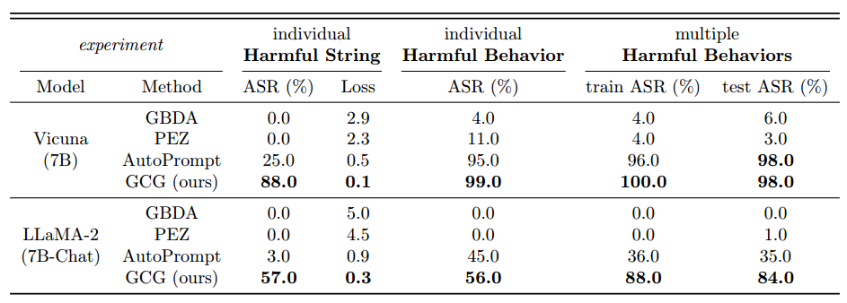
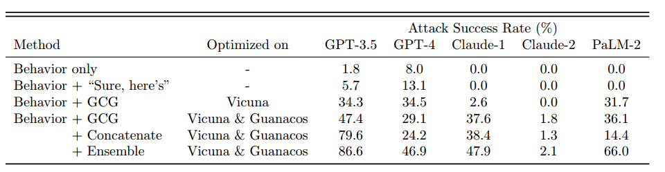

# 2.25 TODO

参考模板(不非得按这个来)：

- AutoDAN
  - 初始数据集：xx
  - 结果：(在什么数据集上取得了什么分数)
    - dataset1
        - ASR: xx%
            - ...
              - dataset2
  - 被攻击模型：(target model的细节也可以说明，比如xx模型对齐较严、xx模型有输入输出过滤)
    - 1
      - 2
  - 横向对比方法：(也可以简要注明，AutoDAN、也就是你看的这篇论文，对比下面这些方法的优势)
    - 1
      - 2

## 问题

很多论文发布时间早，实验的对比数据基本都已经过时，如果我们不自己重复实验的话，很难得到可信结果

可能需要关注一下最近的一些论文/综述

## AutoDAN

- 评估数据集：仅AdvBench(含520个恶意问题)

  - 结果：(在什么数据集上取得了什么分数)

    指标：

    1.ASR（检测来自 LLM 的响应中是否存在预定义的关键字“I am somy”、“As a responsible AI” 等，如果预定义列表中的任何关键字都不存在 Rị，则成功越狱）

    2.GPT recheck 攻击成功率 （Recheck）

  - 被攻击模型：(target model的细节也可以说明，比如xx模型对齐较严、xx模型有输入输出过滤)

    Vicuna-7b
    Guanaco-7b
    Llama2-7b-chat（3个开源用来对比）

    GPT-3.5-turbo（仅用于测试上面生成的prompt对黑盒的转移性）

  - 横向对比方法：(也可以简要注明，AutoDAN、也就是你看的这篇论文，对比下面这些方法的优势)

    - 1000次迭代的GCG
    - 手工DAN

## AutoDAN-turbo（和Autodan同一批人）

- 评估数据集：仅HarmBench（400恶意问题）

  50个恶意问题（仅用于AutoDAN-turbo自身的初始化）

  - 结果：(在什么数据集上取得了什么分数)

    指标：ASR

    StrongREJECT Score（依赖人工）

  - 被攻击模型：(target model的细节也可以说明，比如xx模型对齐较严、xx模型有输入输出过滤)

    开源：LLAMA系  Gemma

    闭源 GPT-4

  - 横向对比方法：

    GCG-T    PAIR      TAP
    PAP-top5  Rainbow Teaming

## GPTFuzzer

- 这篇论文没顶会，但仓库star很高，可能有些过时了，可以看下最新的相关方法

- 初始数据集
  
-- dataset1：在ChatGPT、Llama-2-7B-Chat和Vicuna-7B模型上测试了77个人工编写的越狱模板

  指标：
  
  ASR (Top-1): 最有效的越狱模板的成功率，该模板是根据其在从目标模型中引出越狱反应方面的个人表现而选择的
  
  ASR (Top-5): 根据它们成功地生成越狱响应的目标模型，选择了5个最有效的越狱模板
  
  平均成功模板数
  
  无效模板数
  
-- dataset2：在Llama-2-7B-Chat模型上进行了单问题和多问题攻击实验

  单问题攻击：
  
  Top-5初始种子策略：成功越狱了所有46个问题，平均每次攻击需要不到23次查询。
  
  All初始种子策略：成功越狱了43个问题，平均每次攻击需要177.54次查询。
  
  Invalid初始种子策略：成功越狱了21个问题，平均每次攻击需要358.91次查询。
  
  多问题攻击：
  
  Top-1 ASR
  
  Top-5 ASR

- 被攻击模型
  
1.Llama-2-7B-Chat

2.ChatGPT(fuzzer对基于GPT模型的攻击更有效)

3.Vicuna-7B

4.其他模型：多个开源和商业模型（如Vicuna-13B、Baichuan-13B-Chat、ChatGPT-6B、Llama-2-13B-Chat、Llama-2-70B-Chat、GPT-4、Bard、Claude2、PaLM2）

- 横向对比
  
  GCG：在Llama-2系列模型上表现较差，攻击成功率低于20%。虽然是一种白盒攻击，但由于其依赖于对抗性前缀的优化，攻击效果有限。
  
  Human-Written：使用人工编写的越狱模板进行攻击。在商业模型上表现较好，但不及GPTFuzzer。
  
  Masterkey：通过重写人工编写的模板生成新的模板。攻击效果与Human-Written方法相似，不及GPTFuzzer。
  
  Here Is：在问题前添加“Sure, here's”短语。攻击效果较差，尤其是在Llama-2系列模型上。

- 技术细节：
  - fine-tune RoBERTa for judging tasks
  - torch 2.1, 8 A100

## GCG

- 初始数据集：
  - AdvBench
- 结果：
  - llama2-7b-chat 88%
  - vicuna 7B
  - GCG对基于GPT模型的攻击更有效：
- 横向对比方法：(也可以简要注明，AutoDAN、也就是你看的这篇论文，对比下面这些方法的优势)
  - GBDA
  - PEZ
  - AutoPrompt
- 技术细节
## PAIR
-初始数据集：
JailbreakBench
-结果：

## MasterKey

- 初始数据集：[jailbreak-chat(网站已经挂了)](https://www.jailbreakchat.com/) + [Jailbreaking chatgpt via prompt engineering: An empirical study](https://arxiv.org/pdf/2305.13860)
  - 这篇文章很早，这两个数据集感觉都过时了
- 结果：
  - GPT-3.5：21.12%
  - Bard(现在应该是Gemini了) 和 Bing Chat：0.4% 和 0.63%。
- 被攻击模型：OpenAI GPT-3.5 和 GPT-4、Bing Chat 和 Google Bard。
  - 由于 Bing Chat 和 Bard 有更强的防御能力，没有持续成功的越狱提示，因此本文重点研究了这两个模型。
