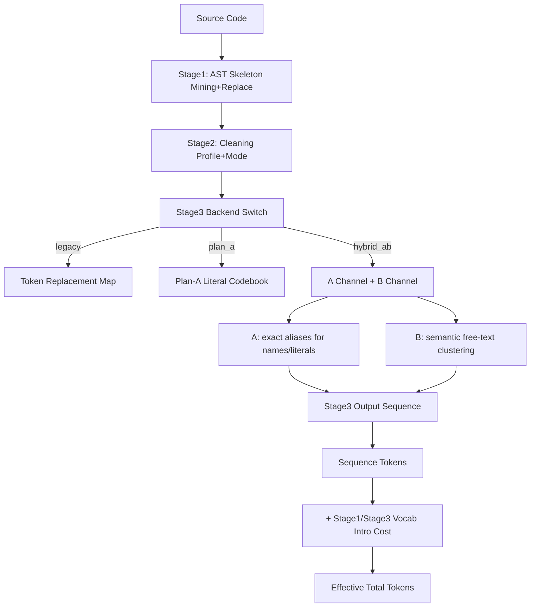

# Stage1/Stage2/Stage3 规则、效果与瓶颈详解报告

- 项目: `entropy_tokenizer_v2`
- 报告时间: 2026-04-07
- 评测口径: StarCoder 前 1M token（`cache/stage1_starcoder_1m_corpus.jsonl`，599 files）
- 主要 tokenizer: `gpt4`（tiktoken）
- 主要 Stage3 backend: `hybrid_ab`（A=exact alias, B=semantic cluster）

## 1. 总览

当前压缩流水线是:

1. Stage1: 语法骨架压缩（`<SYN_n>` + slots）
2. Stage2: 清洗规则（R01-R05，按 profile/mode 执行）
3. Stage3: 词法/字面量压缩（hybrid_ab: A + B）
4. 评估时再把词表引入成本（vocab intro）计入 `effective_total`

在 1M 口径下，`exact_occ2_mrt2` 基线（A-only）结果是:

- `sequence_reduction_pct = 18.6140%`
- `effective_total_reduction_pct = 16.7643%`
- 分阶段贡献:
  - Stage1 语法: `1.1742%`
  - Stage2 清洗: `13.5037%`
  - Stage3 替换: `3.9361%`

可见，当前最大的压缩来源是 Stage2，Stage3 次之，Stage1 最小但稳定。

---

## 2. 流程图（当前实现）



---

## 3. Stage1 详细规则

核心文件:

- `syntax_compressor.py`
- `pipeline.py`

### 3.1 Stage1 做什么

Stage1 会把语法“头部模板”压成 `<SYN_n>`，并把变量部分作为 slot 保留。

示例（概念）:

```python
def foo(a, b):
```

会抽象成骨架:

```text
def {0}({1}, {2}):
```

替换时序列形式:

```text
<SYN_k> foo a b
```

### 3.2 骨架挖掘规则

- 通过 AST 遍历语句节点构建 skeleton。
- 排除风险/收益低节点类型（如 `pass`, `break`, `continue`, `try` 系列）。
- 仅保留出现频次 >= `min_freq` 的 skeleton。
- hybrid_ab 下 Stage1 采矿参数覆盖:
  - `STAGE1_HYBRID_AB_AST_MIN_FREQ=12`
  - `STAGE1_HYBRID_AB_MIN_TOTAL_NET_SAVING=0`

### 3.3 候选打分规则

每个 skeleton 统计:

- `occurrences`
- `total_sequence_net_saving`
- `vocab_intro_tokens`
- `effective_total_net_saving = total_sequence_net_saving - vocab_intro_tokens`

只保留满足阈值的候选:

- `occurrences >= STAGE1_MIN_OCCURRENCES`
- `effective_total_net_saving >= STAGE1_MIN_TOTAL_NET_SAVING`
- `avg_sequence_net_saving >= STAGE1_MIN_AVG_NET_SAVING`

### 3.4 选择规则（greedy）

按候选收益排序，贪心接受 `net_gain > 0` 的条目。

### 3.5 Stage1 实测效果（1M）

- 选中 skeleton 数: `110`
- Stage1 vocab intro: `1809` tokens（全局一次）
- 对总压缩贡献: `1.1742%`

Top skeleton（按 effective net）示例:

1. `def {0}({1}):` -> effective_net `2492`（occ=1014）
2. `def {0}({1}, {2}):` -> effective_net `1405`（occ=452）
3. `def {0}({1}, {2}, {3}):` -> effective_net `857`（occ=141）
4. `from {0} import {1}` -> effective_net `740`（occ=658）

尾部特征（selected pool）:

- min effective net: `1`
- p25: `12`
- median: `36`
- p75: `86`
- max: `2492`

这说明 Stage1 的长尾候选普遍收益很薄。

---

## 4. Stage2 详细规则

核心文件:

- `lossy_cleaner.py`
- `stage2/config.py`
- `stage2/cleaning.py`
- `stage2/docstring_analysis.py`

### 4.1 Stage2 规则定义（R01-R05）

- R01 `remove_comments`: 去注释（保留 shebang/encoding/noqa 等 directive）
- R02 `remove_blank_lines`: 去空行
- R03 `remove_trailing_whitespace`: 去行尾空白
- R04 `remove_indentation`: 去缩进（有损）
- R05 `remove_docstrings`: 去 docstring（默认 `safe_only` 策略，不是无脑删）

### 4.2 执行顺序

`clean_code()` 的顺序是:

1. R05（docstring）
2. R01（comments）
3. R03（trailing ws）
4. R02（blank lines）
5. R04（indentation）

### 4.3 docstring 安全策略（safe_only）

`docstring_analysis.py` 会分析:

- 路径上下文（tests/scripts/examples/internal）
- 是否有运行时 docstring 使用信号（`__doc__`, `inspect.getdoc`, `help`, `pydoc`, `ast.get_docstring`）
- 节点类型（module/class/public/private/nested）
- decorator 风险（`property`, web route decorator 等）
- 结构化文档标记（Args/Returns/:param 等）

默认倾向保守保留:

- module docstring
- public class/function/method docstring
- 高风险 decorator / structured marker 文档

更容易删除:

- private function/class docstring
- 低风险 nested docstring

### 4.4 profile 与 mode

常用 profile（见 `config.py`）:

- `stage2_parseable`
- `stage2_aggressive`
- `stage2_safe`
- `stage2_aggressive_upper_bound`
- `stage2_hybrid_ab_aggressive`（hybrid_ab 默认）

hybrid_ab 默认 Stage2:

- profile: `stage2_hybrid_ab_aggressive`
- mode: `blockwise`

其 flags 等价于:

- remove_comments = True
- remove_blank_lines = True
- remove_trailing_whitespace = True
- remove_docstrings = True（safe_only）
- remove_indentation = True

### 4.5 每条规则实际效果（小样本可复现实验）

样本基线: `128` tokens（gpt4 tokenizer）

| Rule | tokens_after | delta | 备注 |
|---|---:|---:|---|
| R01 remove_comments | 115 | -13 | directive 注释会保留 |
| R02 remove_blank_lines | 127 | -1 | 纯空行收益通常较小 |
| R03 remove_trailing_ws | 127 | -1 | 收益小但稳定 |
| R04 remove_indentation | 117 | -11 | 明显有损，收益较高 |
| R05 remove_docstrings(safe) | 119 | -9 | 只删低风险 docstring |
| stage2_hybrid_ab_aggressive | 98 | -30 | 组合收益最大 |

### 4.6 Stage2 在 1M 实测

- 对整体贡献: `13.5037%`
- 是目前最大压缩来源
- 但该收益含有有损项（尤其 R04）

---

## 5. Stage3 详细规则

### 5.1 backend 选择

Stage3 支持:

- `legacy`
- `plan_a`
- `hybrid_ab`

本报告聚焦 `hybrid_ab`。

核心文件:

- `stage3/backends/hybrid_ab_backend.py`
- `stage3/exact/alias_codec.py`
- `stage3/lexical/semantic_codec.py`
- `stage3/routing/router.py`

### 5.2 Hybrid AB 总体机制

- A 通道: 面向“精确可替换”的名字/字符串
- B 通道: 面向“语义相近自由文本”聚类压缩
- 最后做文件级 guardrail，避免 Stage3 让 sequence 变大

### 5.3 A 通道规则（Exact Alias）

A 通道候选来源:

- `NAME` token: 变量/属性（排除 protected/builtins/关键字/冲突域）
- `STRING` token: 经路由判定为 A

A 通道核心约束:

- `min_occ`（默认该实验是 2）
- `min_raw_token_len`（实验为 2）
- `max_alias_token_len`（实验为 2）
- `min_net_gain`（默认 1）

收益判断:

- `gain = count * (raw_cost - alias_cost) - intro_cost`（local）
- 或 context-aware delta（启用时）

只有 `gain >= min_net_gain` 才接受。

#### A 通道 1M 实测（exact 与 best_hybrid 同 A 参数）

- candidates: `44552`
- selected: `3223`（约 `7.23%`）
- sequence_saved: `57424`
- intro_tokens: `16604`
- effective_net: `40820`
- reject:
  - `min_occ_reject_count = 21064`
  - `net_gain_reject_count = 20265`
  - `route_reject_count = 7745`

说明 A 的主要瓶颈不是“找不到候选”，而是候选太稀疏或净收益不足。

### 5.4 B 通道规则（Semantic Cluster）

#### B 路由（先决条件）

字符串必须先被路由到 B:

- 长文本 sentence-like（或中长文本开关）
- 多行字符串默认禁用，除非 whitelist
- URL/path/regex/identifier-like 通常走 A

#### B 聚类与过滤

1. 生成相似度向量（词袋 / mixed lexical+char）
2. 依据 `similarity_threshold` 聚类
3. 每簇做风险过滤（`avg_similarity >= risk_threshold`）
4. 计算词表引入成本（intro）
5. 只有 `sequence_saved > intro_cost` 才保留

#### 我们新增并已落地的 B 规则

1. 簇定义压缩（`definition_mode=shared_terms`）
2. 代码短化（`b_code_style=base62`, `b_code_prefix=b`）
3. 轻归一化（`b_similarity_norm=light`，对数字/uuid/hex 归一）
4. 成员选择策略开关（`all/drop_negative/net_greedy`）

### 5.5 当前 gpt4 默认（已固化）

在 `resolve_hybrid_ab_settings('gpt4')`，当 `mode=hybrid` 且启用 B 时，默认关键参数为:

- `b_similarity_threshold=0.84`
- `b_risk_threshold=0.74`
- `b_channel_priority=normal`
- `b_similarity_norm=light`
- `b_code_style=base62`
- `b_code_prefix=b`

### 5.6 B 通道示例（真实抽样）

来自 `results/stage3_hybrid_ab_1m_examples.json`:

- cluster 示例: “The host running the process that ... Typically the same host ...”
  - 多个动作差异句子映射到同一 cluster code
- cluster 示例: “The \"part/vendor/product/version\" field from the CPE 2.3 string.”
  - 模板化说明文本聚为一簇

A 通道示例:

- `testObj -> b`（同文件多次）
- `IECore -> c`
- `applicableTo -> m`

---

## 6. 端到端实测结果（1M）

### 6.1 A-only 基线（exact_occ2_mrt2）

- `sequence_reduction_pct = 18.6140%`
- `effective_total_reduction_pct = 16.7643%`
- Stage3 A effective net: `40820`

### 6.2 旧参考 hybrid（0.84 + normal）

- `effective_total_reduction_pct = 16.9032%`
- B effective net: `1216`

### 6.3 当前最佳组合（已写入默认）

- `effective_total_reduction_pct = 16.9863%`
- `sequence_reduction_pct = 18.9606%`
- `replacement_pct = 4.2827%`
- B:
  - used_clusters: `121`
  - sequence_saved: `3603`
  - intro_tokens: `1240`
  - effective_net: `2363`

对比 A-only 基线提升:

- effective total: `+0.2220 pp`
- sequence: `+0.3466 pp`
- B net saving: `+2363`

---

## 7. 瓶颈分析（为什么继续压缩越来越难）

### 7.1 Stage1 瓶颈

1. 高收益 skeleton 已被吃干净
- 头部贡献集中，尾部多数条目收益很薄（median effective net 仅 36）

2. 语法压缩天然有信息下限
- slots 仍需保留，真正可省的是“结构头部”
- 对已有短语句或低重复结构，收益受限

### 7.2 Stage2 瓶颈

1. 当前 profile 已经很 aggressive
- comments/docstrings/indentation 都在处理
- 进一步增益空间主要来自更激进有损策略

2. 安全边界限制
- docstring 安全策略默认保守，不会删除 public/API 文档
- multiline/parse 安全会限制某些可疑清洗

### 7.3 Stage3 A 瓶颈

1. 候选很多，但可盈利比例低
- 44552 候选 -> 3223 选中（7.23%）
- 主要被 `min_occ` 和 `net_gain` 拦截

2. tokenization 下限
- 短 token 字面量（raw_cost 已很低）几乎无压缩空间
- alias 自身也有 token 成本，intro 成本在低频场景难摊薄

### 7.4 Stage3 B 瓶颈

1. 路由门槛导致供给不足
- `stage3_ab_b_route_reject_count = 16648`
- 绝大多数字符串不会进入 B

2. 聚类可用率低
- 候选 literal 2071 -> cluster_count 1843 -> used_clusters 121
- 多数簇要么太小，要么 intro 不划算

3. 词表引入成本是硬门槛
- B 需要额外定义 cluster token；低复用簇会被 intro 吃掉净收益

### 7.5 Effective-total 口径下的共同瓶颈

- 不是“序列省了就算赢”，而是必须覆盖词表引入成本
- 因此许多看起来 sequence 有收益的策略，在 effective-total 上并不优

---

## 8. 哪些是“很难再压缩”的区域

1. 低重复、一次性代码片段
- 无法摊薄词表成本

2. 已经是 tokenizer 单 token 或近单 token 的短字面量
- alias 替换几乎无净收益

3. 语义分散的自由文本
- 难聚类，或簇相似度不达标

4. 受安全策略保护的内容
- public docstring、高风险 decorator 场景等

5. 需要保真/可逆的结构信息
- 在不增加解码复杂度前提下，压缩空间有限

---

## 9. 后续优化方向（按 ROI）

1. B 路由层细化（高 ROI）
- 精准放宽“中等长度模板句”的进入条件，减少误拒

2. B intro 成本继续优化（中高 ROI）
- 更短 definition 表示、跨簇去重、定义模板共享

3. A 的上下文收益估计精细化（中 ROI）
- 更准确地避免低收益 alias，释放 alias budget 给高收益项

4. Stage1 与 Stage3 联动（中 ROI）
- 利用 Stage1 skeleton 结构先验指导 A/B 候选排序

5. 仅在可接受损失边界内增强 Stage2（高风险）
- 进一步有损策略会显著影响可读性/语义，需单独治理

---

## 10. 结论

- 当前系统的主增益来自 Stage2，Stage3 是下一阶段主要优化阵地。
- 本轮对 B 的规则改造已经把 B 净贡献从 `1216` 提高到 `2363`，并把总有效压缩率从 `16.7643%` 提升到 `16.9863%`。
- 后续要继续提升，关键在于: “增加可盈利候选密度 + 降低 intro 摊销成本 + 控制保真风险”。

