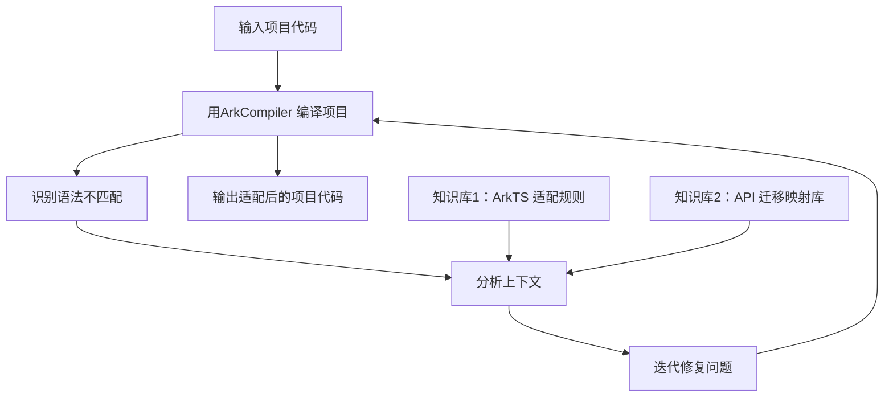

# 论文总结

## arxiv18-Program language translation using a grammar-driven tree-to-tree model

>提出语法驱动的树到树模型用于编程语言翻译，该模型在编码器部分沿用现有树LSTM结构（去除dropout），解码器融入目标语言语法规则，仅生成语法正确程序且无需生成令牌，在FOR到LAMBDA的合成任务中，平均准确率达88.82% ，收敛后达93.70%

现有方法局限：
   - 统计机器翻译（SMT）：易生成语法错误程序，需结合语法知识优化。
   - 传统树到树模型（Chen等人2018）：存在语法无效输出、需生成冗余令牌（增加运算量）等问题。

相关工作：
   - 神经模型应用：图像到代码、文本到代码生成，程序归纳与分类。
   - 语法驱动架构：Yin&Neubig（2017）实现自然语言到Python AST的生成，但未直接利用树结构。

#### 模型设计
1. 整体框架：基于Chen等人的树到树编码器-解码器，核心优化集中在解码器。
2. 编码器设计：
   - 结构：采用树LSTM，输入树通过左孩子-右兄弟表示二值化，从叶子节点开始编码。
   - 改进：去除dropout（未提升训练准确率）。
   - 节点状态计算：\((h,c)=LSTM(([h_{L}:h_{R}],[c_{L},c_{R}]),t_{s})\)，缺失子节点状态用零向量表示。
3. 解码器设计（核心创新）：
   - 语法集成：调用函数获取当前节点可生成的令牌类别，仅从合法类别中选择子节点（如<PLUS>节点仅生成表达式类令牌）。
   - 令牌生成：基于类别专属权重矩阵计算概率，公式为\(t_{t}=argmax softmax\left(W_{k} e_{t}\right)\)，预测难度降低。
   - 训练方式：采用教师强制（输入真实令牌而非生成令牌），避免梯度归零。
   - 优势：无需生成<EOS>令牌，终端节点自动终止分支，减少运算量。
4. 关键区别：不二值化输出树，适配目标语言语法规则。

局限性：
   - 数据依赖：需双语言平行语料，获取难度大。
   - 语法依赖：需目标语言形式语法，无语法时难以生成稀有合法模式。
   - 变量限制：训练前固定变量名和字面量数量。

>属于传统的翻译方法，泛化能力不强

---
## ICSE2022-Code search based on context-aware code translation

南京大学的论文

>研究背景：
软件开发中存在大量重复实现，开发者常搜索高质量代码复用，相关研究表明开发者约19% 的开发时间用于查找可复用代码，代码搜索技术可提升开发效率与质量。

### **核心技术：** TranCS 技术框架

通过代码翻译消除代码（编程语言）与查询（自然语言）的表示差异，通过共享词映射统一嵌入空间。

核心模型：LSTM+注意力模型，感知长上下文依赖

#### 组件 1：上下文感知代码翻译（CCT）

**核心目标：** 将代码片段转换为保留语义的自然语言描述，解决不同语法结构（如 for/while 循环）代码的语义一致性表示问题。

**实施步骤：** 
- 编译 + 反汇编：使用 javac、javap 等工具生成指令序列，对不可编译代码用 JCoffee 补充定义；
- 上下文收集：模拟指令执行，获取局部变量、数据依赖（ operand stack 交互）、控制依赖（指令索引关联）；
- 规则翻译：基于机器指令规范（如 JVM 规范）设计预定义规则，将指令序列 + 上下文翻译为自然语言。

#### 组件 2：共享词映射机制（SWM）

**解决问题：** 现有技术多词汇表导致的嵌入差异，SWM 构建单一词汇表（包含翻译与查询中高频词），统一嵌入生成函数。

### 评价：

代码翻译技术的主要创新在于 **编译+反汇编**，使用JCoffee解决代码片段缺失上下文而无法编译的问题（？没见过的工具，有时间看一下），翻译的主要目的是将代码片段翻译到自然语言以构建嵌入向量（用于小段的代码匹配，应该不太方便拓展到大段代码乃至整个仓库）。但是论文最终目的并非代码翻译

---

## ASE2023-On the evaluation of neural code translation: Taxonomy and benchmark

>研究背景：
神经代码翻译旨在将代码从一种编程语言迁移到另一种，可解决多平台软件开发中手动翻译繁琐、成本高的问题。目前研究多聚焦于改进模型架构与训练流程（如预训练模型 CodeBERT、CodeT5 等已成为主流），但评估环节存在严重局限：
现有基准（如 CodeXGLUE）将所有翻译任务视为同等难度，未区分复杂度；
评估流程（如基于 BLEU）仅提供整体性能分数，无法拆解模型在不同维度的能力，导致简单翻译（如关键词映射）易获高准确率，复杂翻译（如算法重写）分数低却难以体现模型真实短板。

### 主要内容

将代码翻译按难度（个人觉得也可以说是按评估方法）分成了四类

| 类型   | 名称       | 核心描述                                                                 | 知识依赖                                                                 | 示例（C++→Java）                          |
|--------|------------|--------------------------------------------------------------------------|--------------------------------------------------------------------------|-------------------------------------------|
| Type 1 | 令牌级     | 仅需简单令牌映射，无需编程语言规则                                       | 仅需关键词、标识符映射知识（如“bool”→“boolean”）                         | “INT_MIN”→“Integer.MIN_VALUE”             |
| Type 2 | 语法级     | 需迁移语法结构，依赖两种语言的语法规则                                   | 需语言语法规则（如变量声明、循环结构）                                   | C++“for(char x : s)”→Java“for(int i=0; i<s.length(); i++)” |
| Type 3 | 库级       | 需迁移库与API使用，依赖外部库知识（API功能、参数含义）                   | 需语言语法+外部库知识（如栈操作API：“stack.top()”→“Stack.peek()”）       | C++“st.top()”→Java“st.peek()”             |
| Type 4 | 算法级     | 需重写算法逻辑，源与目标代码令牌重复率低，可能无直接API对应               | 需语言语法+库知识+算法设计能力（如迭代实现阶乘→递归实现阶乘）             | C++循环求阶乘→Java递归求阶乘               |

**验证结果**：将TransCoder-test按分类法分为3类（无Type 4样本），样本量384（Type1）/341（Type2）/223（Type3），所有模型性能随类型升级显著下降（如TransCoder在Type1→Type2→Type3中，BLEU下降9.2%→21.8%，CA下降14.8%→42.5%），证明分类法能有效区分翻译复杂度。

#### 翻译工具在数据集上的表现
- 令牌维度（关键词、标识符）：平均准确率 98.5%；
- 语法与符号维度：平均准确率超 97%（CodeBERT 稍低，语法 89%、符号 90%，因无预训练解码器）；
- API 维度：平均准确率 86.25%；
- 语义维度（单元测试通过率）：平均准确率仅 75.25%。
结论：SOTA 模型擅长令牌翻译，其次是语法、API，语义翻译能力最弱。

***按照该论文的理论，我们的工作的类型疑似介于 type3和type4之间***

---

## arxiv2025-Skeleton-Guided-Translation-A Benchmarking Framework for Code Repository Translation with Fine-Grained Quality Evaluation

>现有代码翻译技术受限于基准缺陷，难以满足企业级代码库迁移需求，核心挑战包括：
1. 基准聚焦范围局限：多数基准（如 CodeXGLUE、AdvBench）仅关注单个函数或竞赛式问题
2. 评估粒度粗糙：传统二进制指标（如 RepoTransBench 的 “构建成功 / 失败”）无法区分 “部分组件翻译正确、部分失败” 的情况
3. 数据与测试痛点：库级平行语料稀缺，自动化生成功能测试不成熟（Eniser et al., 2024）

### 核心内容：Skeleton-Guided-Translation 框架

翻译语言：Java->C#

**第一步** ：骨架提取

**第二步** ：以目标语言骨架为指导，填充函数实现细节

>与我们的工作的区别在于，该项目在翻译仓库的同时生成了目标仓库的结构、单元测试和测试环境，后续可以学习其方法。但个人认为**如果只是基于骨架-填充的方法，效果应该有局限性**，从论文中提到某些仓库翻译的通过率完全为0可以看出方法的泛化能力有所欠缺。这一点在尤其是对于在编译型语言和非编译型语言之间的翻译任务来说，其骨架本身就有可能有重构需要的可能。

评估指标：1. 构建成功率   2. 单元测试通过率

---
## ASEW2023-Javabert-Training a transformer-based model for the java programming language

>研究背景：
为提升软件质量并填补机器学习在软件工程（SE）领域的应用空白，研究者提出针对 Java 语言的 Transformer 模型JavaBERT。

### RQ：

RQ1：如何检索用于训练的代码数据？

解决代码语料稀缺问题，构建语言无关的数据检索 pipeline，以 Java 为例收集高质量训练数据。

RQ2：如何为编程语言训练 NLP 模型？

设计适配代码语法特征的预处理方法，对比 Java 特定分词器与通用 NLP 分词器的性能，验证语法特征对模型的提升作用。

RQ3：编程语言模型的性能如何？

定义评估指标，对比自定义模型与现有模型（如 CodeBERT）的性能，验证模型在掩码语言建模（MLM）任务的有效性。

> NLP领域的论文，似乎跟我们的研究关系不大

---
## ICSE24-Lost in translation-A study of bugs introduced by large language models while translating code

该研究针对大语言模型（LLMs）代码翻译引入的缺陷展开大规模实证分析，选取 7 个 LLM（含 GPT-4、StarCoder 等），对 1700 个代码样本（来自 3 个基准数据集和 2 个真实项目，覆盖 C、C++、Go、Java、Python 五种语言）执行 43379 次翻译，发现 LLM 正确翻译率仅 2.1%-47.3%（GPT-4 表现最佳为 47.3%，真实项目翻译成功率更低）
> 看了一下是单个函数的翻译。好奇用大模型翻译这种单文件的代码正确率怎么会这么低？？？

主要缺陷：

| 缺陷组                | 包含缺陷类型                                                                 | 占比（总缺陷） | 典型案例                                                                 |
|-----------------------|------------------------------------------------------------------------------|----------------|--------------------------------------------------------------------------|
| 语言语法语义差异      | 违反目标语言要求、复制源语言语法、API行为不匹配、运算符使用错误               | 30.5%          | Java→Go时，将Java的`String.substring()`错误映射为Go的`strings.IndexByte()`（返回值类型不符） |
| 依赖与逻辑缺陷        | 缺失库导入、缺失定义、循环/条件错误、逻辑增删、API替换后行为不匹配           | 24.2%          | C++→Go时，`solve()`方法调用保留但定义被删除                               |
| 数据相关缺陷          | 数据类型错误、输入解析错误、输出格式化错误                                   | 33.5%          | Python→C时，输入3个整数但C代码仅读取2个，第3个赋值为0                   |
| 模型特定缺陷          | 代码中混入自然语言、超出token限制                                           | 6.6%           | Click项目翻译中，LLM输出“翻译不可行”的自然语言说明                       |
| 其他（实验设置相关）  | 内存问题等                                                                   | 5.2%           | -                                                                        |
- **关键发现**：数据相关缺陷占比最高（33.5%），其中输入解析错误（18.1%）和数据类型错误（11.5%）是主要子类型；真实项目缺陷与基准数据集差异显著，真实项目中模型特定缺陷（29.4%）、缺失导入（27.4%）更常见。

---
## IMCL25-Function-to-style guidance of llms for code translation

>为解决大语言模型（LLMs）在代码翻译中正确性不足与可读性欠缺的问题，研究团队提出F2STRANS 框架，该框架通过 “功能学习（Functional Learning）→风格学习（Style Learning）” 两阶段引导范式提升性能：功能学习阶段利用从在线编程平台挖掘的高质量源 - 目标代码对优化翻译正确性，风格学习阶段结合正负风格示例改善可读性

### 主要内容

提出了F2STRANS 框架，通过两阶段来分别学习代码的 **功能** 和 **风格** ：

1. 功能学习：

从大量针对同一问题的解决方案中选择高度相关的源 - 目标代码对（这里先使用jina嵌入代码，基于余弦相似度检索相似代码对，然后基于大模型评判代码的相似评分，最后得到高度相关的代码对）

2. 风格学习：

通过 CSSim（综合变量命名、API 调用、代码结构的编辑距离）计算候选正例间的相似度，选择与其他正例风格最一致的作为最终正例，公式太长不看

>论文中主要采用计算准确率来评估大模型的翻译结果（即相同输入下输出相同的比率，但是这种方法似乎只能反映功能是否正确，不知道代码可读性是如何评估的，但是论文的消融实验中提到，进行风格的训练有利于生成正确率更高的代码）

>这篇论文主要的工作在于微调大模型参数以适应其在代码翻译过程中的功能需求和风格需求，主要创新点为通过一系列方法来优化训练数据的收集和提取（功能学习和风格学习的训练数据）

---
## PACMSE25-Porting Software Libraries to OpenHarmony-Transitioning from TypeScript or JavaScript to ArkTS

>为解决将 TS/JS库移植到 OpenHarmony 平台（主语言为ArkTS）时需大量手动修改的问题，研究团队提出ArkAdapter—— 一种项目级自动代码适配工具。它通过构建适配知识库（含 79 条 ArkTS 适配规则与多场景少量示例）解决大语言模型（LLMs）对 ArkTS 语法理解不足的问题，采用适配优先级策略（按测试代码优先、依赖关系等 5 项标准排序）处理代码间干扰，在定位语法不匹配代码时实现86.84% 的精度与100% 的召回率，且 80.14% 的代码适配结果与开发者手动适配一致；最终成功移植 79 个主流 TS/JS 库中的70 个（88.6%），通过 ArkCompiler 验证与 OHPM 中央仓库审核，有效推动 OpenHarmony 软件生态建设。

### 工作流程
1. 初始化两大知识库：

- ArkTS 适配规则库: 每条规则以 quadruple 存储：<Error（编译器错误信息）、Description（规则描述）、Suggestions（适配建议）、Few-shot examples（少量示例）> 
- API 迁移映射库：Node.js到ArkTS内置模块api映射；测试断言API映射

2. 编译环境配置：
    1. 调整目录结构
    2. 配置依赖（确保第三方依赖已经迁移至OHPM）

3. 用ArkCompiler 编译项目，识别语法不匹配，分析上下文，迭代修复问题

>和其他语言之间的翻译不同，ArkTS和TS/JS的相似度非常高（因为ArkTS本身就是TS/JS的超集），所以可以在进行少量代码替换后直接用ArkCompiler编译TS/JS，然后再根据错误信息进行适配，相当于跳过了翻译过程，直接到修复bug的阶段，而这在其他语言的翻译中是不可行的。

---
## arxiv25-Repotransbench-A real-world benchmark for repository-level code translation

>为解决现有代码翻译基准多聚焦于代码片段、函数或文件级（无法反映真实场景中整个代码仓库翻译需求）的问题，研究团队提出RepoTransBench—— 一个包含 1,897 个真实仓库样本、覆盖 13 个语言对且带有自动可执行测试套件的真实世界多语言仓库级代码翻译基准，同时开发RepoTransAgent（基于 ReAct 范式的通用智能体框架）用于仓库级代码翻译；通过 8 个主流 LLM（4 个开源、4 个闭源）评估发现，仓库级翻译仍具挑战性，最佳方法成功率仅32.8%，且翻译难度存在显著语言对差异（静态到动态语言翻译成功率 45%-63%，动态到静态低于 10%），还识别出配置文件问题、上下文理解不足等 5 类核心错误，为后续 LLM 改进提供参考。

## arxiv18-Marian-Fast neural machine translation in C++

>Marian 是一款完全用C++11 编写的高效神经机器翻译（NMT）框架，集成基于动态计算图的反向模式自动微分引擎，其核心设计包括可扩展的编码器 - 解码器框架、高效元算法（如多设备训练、批量束搜索等），

### 核心架构

#### 自定义自动微分引擎
- 技术基础：基于反向模式自动微分与动态计算图，设计上与 DyNet（Neubig et al., 2017）最接近，但专门针对机器翻译场景优化。
- 关键优化：实现高效的融合 RNN 单元、注意力机制（如 Bahdanau 式）、原子层归一化算子（Ba et al., 2016），提升翻译相关任务的计算效率。

#### 可拓展编码器-解码器框架

支持不同编码器 - 解码器组合（如 RNN 编码器 + Transformer 解码器），新模型仅需实现单个推理步骤即可支持训练、评分与翻译，降低开发成本。

>看了半天才发现是自然语言的翻译，和代码翻译应该没什么关系

---
## ICSE23-On ML-based program translation-perils and promises

>本文聚焦无监督机器学习驱动的程序翻译，以 Facebook AI 的 TransCoder 模型为研究对象，指出其因统计特性存在语法错误、语义错误等问题，且错误呈现特定模式；通过设计基于规则的程序变异引擎进行预处理（如类型转换、循环转换）和后处理（如移除额外约束），构建混合翻译工具，使 Java 到 Python 翻译准确率提升 86%、Python 到 Java 提升 50%，并展望了嵌入编程领域知识的端到端翻译系统的未来方向。

**TransCoder**：Facebook AI 提出的无监督代码翻译器，通过回译学习语言对齐，无需对齐语料，性能超越传统方法，训练于 128M GitHub 仓库，基于 2.8M 开源仓库语料

### 研究内容

从 GeeksForGeeks 选取测试数据，随机抽样 50 个 Java→Python（J2P）和 50 个 Python→Java（P2J）测试用例，每个用例含焦点方法f_gold()及测试用例，人工分析翻译结果，归类错误模式，设计规则型预处理 / 后处理策略，验证改进效果。

**关键错误模式**

| 错误类型         | Java→Python（J2P）占比 | Python→Java（P2J）占比 | 错误描述                                                                 |
|------------------|------------------------|------------------------|--------------------------------------------------------------------------|
| 额外上下文       | 18%（9/50）            | 38%（19/50）           | 混淆焦点方法与主方法/测试用例，翻译无关内容导致代码错误/不可读             |
| 循环转换         | 12%（6/50）            | 0%                     | 无法正确将Java复杂for循环转换为Python循环，4/6案例生成无效代码            |
| 类型敏感性       | 38%（19/50）           | 4%（2/50）             | 对数组等类型处理失败（如Java数组→Python参数翻译错误）                     |
| 多余约束         | 0%                     | 50%（25/50）           | 给if/while语句添加额外逻辑运算符，改变代码语义（语法合法但功能异常）       |
| 其他错误         | 14%（7/50）            | 16%（8/50）            | 未归类的零散错误                                                         |
| （基本）正确翻译 | 22%（11/50）           | 18%（9/50）            | 无需修正或少量修正即可使用的翻译结果                                     |

**解决方案：混合翻译框架**
1. **核心思路**：通过**基于规则的程序变异引擎**，对输入代码预处理、输出代码后处理，弥补TransCoder的统计缺陷。
2. **具体策略**：
   | 错误类型         | 处理方式 | 操作细节                                                                 |
   |------------------|----------|--------------------------------------------------------------------------|
   | 额外上下文       | 预处理   | 隔离焦点方法，移除主方法、测试用例等无关内容                             |
   | 循环转换         | 预处理   | 将Java复杂for循环语义等价转换为while循环（Java与Python中while语义一致）   |
   | 类型敏感性       | 预处理   | 将Java数组参数转换为List（含包装类，如int→Integer），统一翻译映射          |
   | 多余约束         | 后处理   | 移除目标代码中源程序不存在的逻辑约束（模型仅添加不修改原始条件）         |

