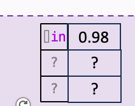
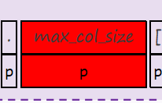

## TODO 5.20

1.benchmark：600个项目分长度的分法描述 √

2.benchmark：python如何构建 √

3.benchmark详细信息填空 √

4.结果表格填空 √

## **TODO 5.27**

1.《gotcha》复现  

2.Java的实验结果 √ 还差gpt

3.Ablation Study 

4.Case Study

5.java benchmark 文字

## TODO 6.10

1.token概率取值，2个代表性的

2.连接token概率查看，是否存在p？

3.《gotcha》复现  结果填表

4.对目前方法的素材更新补充

5.Java的实验结果 √ 还差gpt

延期todo：Ablation Study 、Case Study
