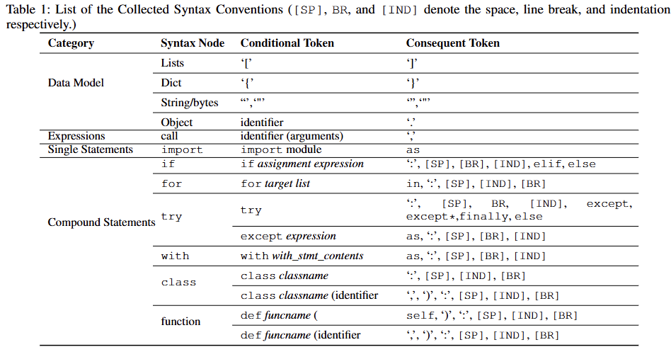

## TODO 5.20

1.benchmark：600个项目分长度的分法描述 √

2.benchmark：python如何构建 √

3.benchmark详细信息填空 √

4.结果表格填空 √

## **TODO 5.27**

1.《gotcha》复现  

2.Java的实验结果 √ 还差gpt

3.Ablation Study 

4.Case Study

5.java benchmark 文字

## TODO 6.10

1.token概率取值，2个代表性的 √

2.连接token概率查看，是否存在p？ √

3.《gotcha》复现  结果填表-延期

4.对目前方法的素材更新补充 

5.Java的实验结果 √ 还差gpt  √

延期todo：Ablation Study 、Case Study

## TODO 7.20

1. Methodology讨论
   1. **先确定“必须保留”的位置——标识符区间**
      - 把代码送入 AST 解析，遍历节点提取所有 **变量、函数和类名**。
      - 利用 `lineno` 和 `col_offset` 信息，将它们精确映射回源码中的**字符起止区间**。
      - 这些区间构成“白名单”：稍后无论任何规则，落在区间里的 token 都不会被屏蔽。
   2. **获得每个子词 token 对应的源码区间**
      - 用 Tokenizer 的 `encode_plus(..., return_offsets_mapping=True)` 得到 **token → 字符区间** 的一一对应表。
      - 这样就能把子词层面的处理与源码坐标精确对齐。
   3. **按规则生成布尔 mask（默认全保留，满足条件则设为 False）**
      - **排版与占位**：`[PAD]`、缩进空格／制表符生成的 token。
      - **闭合关键词**：`else, elif, except, finally` 等；再加控制流终结词 `return, break, continue, pass, raise`。
      - **结构符号**：右括号 `) ] }`、冒号 `:`、下划线 `_`、纯数字。
      - **常见标点与运算符**：逗号、点号、引号、加减乘除等。
      - **属性访问中的点号**：`self.foo` 或 `obj.bar` 里，用来连接标识符的 `.` 也被屏蔽。
      - **变量保护**：如果 token 所在区间与步骤 1 得到的任何标识符区间重叠，则**无论上述条件如何**都强制保持 True。
   4. **结果与用途**
      - 得到与序列长度一致的 `mask` 布尔向量，**True = 保留、False = 剔除**。
      - 计算 Mink‑score 时仅在 True 位置收集对数概率，然后重新归一化并做“最难 k% 均值”。
      - 效果是：
        - **剔除语法噪声**（括号、冒号、闭合关键字……），让分数聚焦于真正承载语义的 token；
        - **保护标识符完整**，即使一个变量被 BPE 切成多个子词也不会被部分屏蔽；
        - 降低代码风格、缩进、长度差异对检测指标的干扰，提高对语义难度的敏感度。
2. benchmark构建好了，ratio的部分怎么写，写在哪？✔
3. Function Length.分类怎么写，是否要做实验？——统计具体分段的token数。正样本做长度区分
4. case study——扩展2条 ✔
5. todo：ablation study

## TODO 7.23

1. method完备性

   

2. case license

   1. **Case A - 网络协议单元测试**

   - 代码片段：tests/test_message_director.py 中的 Datagram.create / add_uint32

   - 上游项目：Astron（Toontown/OpenToontown 服务器的网络中间件）

   - 仓库地址：https://github.com/Astron/Astron

   - Licence：BSD-3-Clause

   2. **Case B - Bitcoin 交易序号边界检查**

   - 代码片段：test/functional/abc_tx_sequence.py（或同类脚本）

   - 上游项目：Bitcoin Core

   - 仓库地址：https://github.com/bitcoin/bitcoin

   - Licence：MIT

   3. **Case C - 球谐函数归一化常数**

   - 代码片段：pyscf/gto/spheric_eval.py::c2s_bra (或 pyscf 内其他同名函数)

   - 上游项目：PySCF (Python-based Simulations of Chemistry Framework)

   - 仓库地址：https://github.com/pyscf/pyscf

   - Licence：Apache-2.0

   4. **Case D - Fail2ban ticket 时间戳测试**

   - 代码片段：fail2ban/tests/test_ticket.py 中的 FailTicket … setTime/ getTime

   - 上游项目：Fail2ban

   - 仓库地址：https://github.com/fail2ban/fail2ban

   - Licence：GPL-2.0-or-later

3. benchmark数据

4. 四张AUROC图

5. 方法长度实验结果

6. ablation 48行结果
